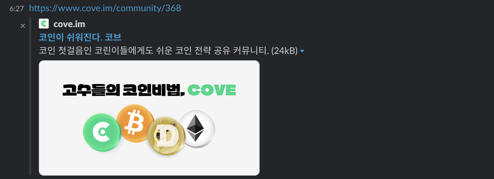
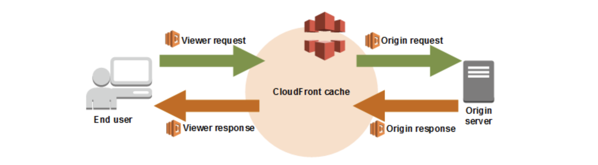
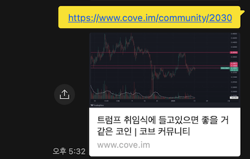
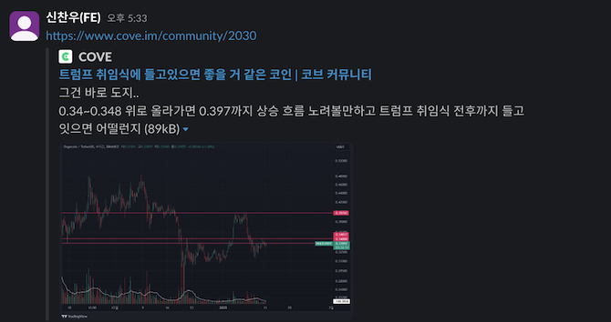
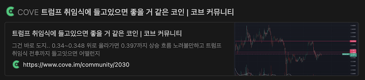
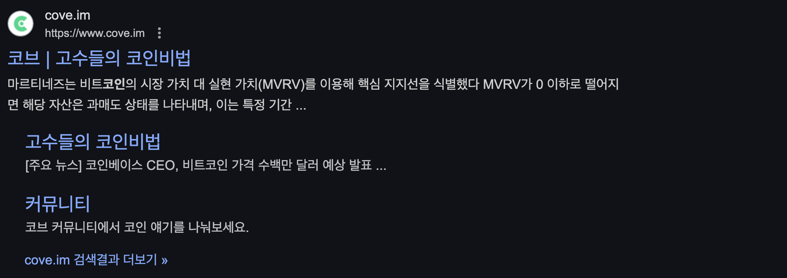
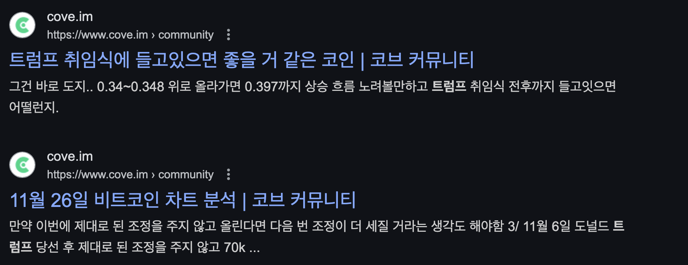

## 들어가며

프론트엔드 개발을 하다 보면 단순한 화면 작업뿐만 아니라, **SEO(Search Engine Optimization)** 와 **오픈 그래프(Open Graph)** 를 위한 **메타 태그(meta tag)** 를 처리해야 하는 경우가 많습니다.
저는 최근에 `커뮤니티` 도메인의 사이드 프로젝트를 진행하면서 **CSR(Client-Side Rendering) 환경에서 동적으로 메타 태그를 생성해 제공**했던 경험이 있었습니다.
이 경험이 왜 유의미했는지 소개하기 위해 **SEO**, **Open Graph**, **CSR** 등의 핵심 개념을 간략히 짚고, **CSR 환경에서 효과적으로 메타 태그를 다루는 방법**을 공유해보려 합니다. (이미 알고 계시다면 [문제 발생](#문제-발생) 섹션으로 바로 넘어가세요!)

### SEO란?

**SEO(Search Engine Optimization, 검색 엔진 최적화)** 는 웹사이트가 검색 엔진 결과에서 더 잘 노출될 수 있도록 최적화하는 과정입니다. 검색 상위 노출을 통해 트래픽을 유입하는 것은 웹서비스를 운영하는 기업이나 팀에게 매우 중요한 목표입니다.

SEO를 개선하는 방법에는 여러 가지가 있습니다. 대표적인 요소로는:

- 모바일 최적화: 반응형 디자인을 적용해 모바일 사용자 경험 개선
- 사이트맵 제공: 검색 엔진이 사이트 구조를 쉽게 이해하도록 XML 사이트맵을 제공
- 로딩 속도 개선: 페이지 로딩 속도를 최적화하여 사용자 이탈률 감소
- **HTML 및 메타 태그 최적화**: 검색 엔진이 페이지 내용을 정확히 파악할 수 있도록 메타 태그를 적절히 설정
  특히 **메타 태그(meta tag)** 는 페이지의 콘텐츠를 검색 엔진과 소셜 미디어 플랫폼에 정확하게 전달하는 중요한 요소입니다.

#### 메타 태그 예시
```html
<title>서울 맛집 추천 | 2024년 꼭 가봐야 할 핫플 BEST 10</title>
<meta
  name="description"
  content="서울에서 가장 인기 있는 핫플 맛집 10곳을 추천합니다. 현지인이 강력 추천하는 숨은 맛집 리스트를 확인하세요!"
/>
<meta name="keywords" content="서울 맛집, 핫플 추천, 베스트 레스토랑, 현지인 추천" />
<meta name="author" content="맛집 탐방러" />
```

이러한 메타 태그를 설정하면 검색 엔진이 페이지 내용을 더 잘 이해할 수 있으며, 검색 결과에서 보다 적절한 미리보기를 제공할 수 있습니다.

다만, **Google 검색 엔진**은 `keywords`, `author` 등의 **메타 태그를 무시**한다고 공식적으로 발표한 바 있습니다. (출처: [Google 공식 블로그](https://developers.google.com/search/blog/2009/09/google-does-not-use-keywords-meta-tag?hl=ko))

하지만 검색 엔진마다 적용 방식이 다르므로, **네이버**, **빙(Bing)** 등 다양한 검색 엔진을 고려하여 메타 태그를 설정하는 것이 유리하다는 의견도 있습니다.

### 오픈 그래프 (Open Graph)?

**오픈 그래프(Open Graph, OG)** 는 메타 태그를 활용하여 **웹페이지가 소셜 미디어에서 공유될 때 미리보기 정보를 제어하는 기술**입니다.
이 기술은 원래 페이스북(Facebook)에서 개발한 프로토콜이지만, 현재는 트위터(Twitter), 카카오톡(KakaoTalk), 디스코드(Discord) 등 다양한 플랫폼에서 활용되고 있습니다.

즉, 사용자가 링크를 공유하면, 해당 플랫폼은 웹페이지의 HTML에서 오픈 그래프 메타 태그를 읽어 아래와 같은 정보를 표시합니다.

**✔ 제목 (Title)**<br />
**✔ 설명 (Description)**<br />
**✔ 대표 이미지 (Image)**<br />
**✔ 링크 (URL)**

#### 오픈 그래프 적용 예시
[React 공식 문서](https://react.dev/) 페이지를 카카오톡으로 공유하면 아래와 같은 오픈 그래프 정보가 표시됩니다.


이제 개발자 도구(Chrome DevTools)를 열어 **Elements** 탭에서 오픈 그래프 메타 태그를 확인해보겠습니다.

```html
<meta property="og:type" content="website" data-next-head="" />
<meta property="og:url" content="https://react.dev/" data-next-head="" />
<meta property="og:title" content="React" data-next-head="" />
<meta
  property="og:description"
  content="React is the library for web and native user interfaces. Build user interfaces out of individual pieces called components written in JavaScript. React is designed to let you seamlessly combine components written by independent people, teams, and organizations."
  data-next-head=""
/>
<meta property="og:image" content="https://react.dev/images/og-home.png" data-next-head="" />
```

각 태그는 다음과 같은 역할을 합니다.

| 태그명           | 설명                                        |
| ---------------- | ------------------------------------------- |
| `og:type`        | 콘텐츠 유형(예: website, article, video 등) |
| `og:url`         | 공유될 웹페이지의 원본 URL                  |
| `og:title`       | 페이지 제목                                 |
| `og:description` | 페이지 설명 (SNS 미리보기 텍스트)           |
| `og:image`       | 공유될 때 표시될 대표 이미지                |

#### 오픈 그래프 데이터 구조

카카오톡, 페이스북 같은 플랫폼에서는 이 오픈 그래프 데이터를 기반으로 미리보기 카드를 생성합니다.
각 플랫폼마다 디자인은 다를 수 있지만, 대부분 아래와 같이 정보를 출력합니다.


잘 구조화된 오픈 그래프가 존재하면, 사용자는 링크를 클릭하기 전에도 어떤 내용이 있는지 미리 확인할 수 있어 **클릭률(CTR)이 증가**하고, **브랜드 신뢰도**도 높아집니다.

### CSR vs SSR

**CSR(Client-Side Rendering)** 과 **SSR(Server-Side Rendering)** 은 웹 애플리케이션의 렌더링 방식에서 중요한 차이를 보입니다. 이 차이는 메타 태그 및 오픈 그래프 데이터를 처리하는 방식에도 영향을 미칩니다. CSR과 SSR을 간단하게 소개하며 특징을 비교해보겠습니다.

#### CSR (Client-Side Rendering, 클라이언트 사이드 렌더링)

**CSR**은 **브라우저(클라이언트)에서 JavaScript를 실행하여 페이지를 동적으로 렌더링하는 방식** 입니다.

##### **특징**

- **초기 로딩 속도가 느림**: 브라우저에서 Javascript 파일을 다운로드 받고 동적으로 DOM을 그려주기 때문에 초기 로딩 속도가 느림.
- **인터랙션이 빠름**: 새로고침 없이 빠른 인터랙션을 제공하여 앱과 같은 사용성을 받음.
- **SEO, 오픈 그래프에 불리함**: 검색 엔진 크롤러는 HTML을 수집하는데, **CSR**의 경우 초기 HTML이 비어있어 검색 엔진이 페이지 내용을 제대로 읽지 못하여 SEO에 불리함. 또한 서버 데이터가 필요한 오픈 그래프의 경우 초기의 메타 태그를 선언해주기 어려움.

#### SSR (Server-Side Rendering, 서버 사이드 렌더링)

**SSR**은 서버에서 HTML을 완전히 만들어서 클라이언트(브라우저)에 전달하는 방식입니다.

##### **특징**

- **초기 로딩 속도가 빠름**: 서버에서 HTML을 생성하여 클라이언트에 제공하기에 클라이언트는 빠르게 초기 화면을 볼 수 있음.
- **SEO, 오픈 그래프에 유리함**: 서버에서 완전한 형태의 HTML을 제공하므로 검색 엔진 크롤러가 페이지를 정확하게 인식하고 색인이 가능하며, 서버 데이터가 필요한 오픈 그래프의 경우에도 유리함.

---

## 문제 발생

최근 진행한 `커뮤니티` 도메인의 사이드 프로젝트에서는 **CSR 환경에서 동적으로 메타 태그를 생성하여 제공**해야 하는 상황을 마주했습니다.<br />
특히, **커뮤니티**의 특성상 **유저 간 링크 공유**가 활발하기 때문에, **오픈 그래프(Open Graph) 데이터가 정확하게 제공**되는 것이 필수적이었습니다.<br />
커뮤니티 서비스에서는 사용자가 흥미로운 게시글을 발견하면, 카카오톡이나 메시지로 친구들과 링크를 공유합니다.
이때, 공유받은 사람은 오픈 그래프 미리보기를 통해 글 제목, 요약, 대표 이미지 등을 사전에 확인할 수 있습니다.

> **✅ 오픈 그래프 정보가 잘 표시되면?<br />**
> → 사용자는 클릭하여 사이트에 방문할 가능성이 높아지고, 결과적으로 **유저 유입 및 리텐션이 증가**합니다.<br /><br /> > **❌ 오픈 그래프 정보가 제대로 표시되지 않으면?<br />**
> → 단순한 URL 링크만 보이므로, 사용자는 **흥미를 느끼지 못하고** 클릭하지 않을 가능성이 큽니다.

즉, 오픈 그래프 최적화는 커뮤니티 서비스의 **성장과 유저 유지(User Retention)** 에 직접적인 영향을 미치는 요소입니다.
그렇기 때문에 동적으로 효과적인 오픈 그래프를 제공해야하는데 저희 서비스는 그렇지 못했습니다. 아래 이미지처럼 **상세 게시글을 공유해도 정적인 데이터만 표시**되었습니다.


어려움을 겪은 이유는 저희 프로젝트의 **기술 스택** 때문이었습니다. `Vite + React` 기반의 **CSR** 방식으로 개발되었으며, 배포는 `AWS`의 `S3`에 **정적 파일을 업로드**하고, `CloudFront`를 통해 **CDN 기능 제공**하는 구조를 사용하고 있고 **백엔드와의 데이터 통신**은 `REST API`를 활용하고 있습니다.

이러한 기술 인프라에서 **커뮤니티의 게시글 상세 페이지**는 아래와 같은 흐름으로 동작합니다.

1. 사용자가 특정 게시글의 URL(`https://example.com/post/123`)에 접근
2. 클라이언트가 게시글 ID(`123`)를 백엔드 API에 요청
3. 백엔드에서 게시글 데이터(제목, 내용, 이미지 등)를 반환
4. 백엔드로부터 데이터를 받으면, 클라이언트가 화면을 렌더링

이 방식은 위에서 정리한 [CSR](#csr-client-side-rendering-클라이언트-사이드-렌더링) 특징처럼, 일반적인 사용자 경험(UX)에서는 문제가 되지 않지만, **검색 엔진 크롤러나 오픈 그래프 크롤러가 페이지를 수집할 때 문제**가 발생합니다.

##### **검색 엔진 크롤러 & 오픈 그래프 크롤러의 동작 방식**

검색 엔진 크롤러(**예: Googlebot**)나 오픈 그래프 크롤러(예: **Facebook, Twitter, KakaoTalk 등**)는 특정 URL에 HTTP 요청을 보낸 후, 응답된 HTML 문서를 분석합니다.<br />
이때, `<head>` 태그 내부의 메타 태그(meta tag) 값을 읽고, 이를 검색 색인이나 SNS 미리보기로 활용합니다.

즉, 링크를 공유하면 크롤러는:

1. `https://example.com/post/123` 페이지에 접근
2. HTML 문서를 다운로드 및 분석
3. `<head>` 태그에서 `og:title`, `og:description`, `og:image` 등의 메타 정보를 읽음
4. 해당 정보를 기반으로 검색 결과나 SNS 미리보기 카드 생성

물론 CSR에서도 [react-helmet](https://github.com/nfl/react-helmet) 같은 라이브러리를 사용하여, 페이지별 **정적인 메타 태그**를 설정할 수 있습니다. 그러나 **서버에서 동적으로 가져오는 데이터 (예: **게시글 상세 데이터**)** 를 기반으로 하는 메타 데이터는 설정할 수 없는 한계가 있습니다.

---

## 문제 해결 과정

이렇듯 CSR 환경에서 동적으로 메타 태그를 제공하기 위해 고민했던 방법은 크게 **두 가지**였습니다.

### 해결 방법1 : **SSR** 로 마이그레이션

**SSR로 전환**하는 것이 가장 확실한 해결책이라 느꼈습니다. `Vite`에서 SSR을 지원하는 방식도 있고, `Next.js`로 완전히 옮기는 방법도 있습니다. SSR도 전환을 하면 SEO도 강화되며 오픈 그래프 문제도 해결 가능할 것 같았습니다. 하지만 SSR로 전환하는 것은 **기존 프로젝트가 CSR로 구축된 경우 높은 비용과 리소스를 요구**한다고 판단했습니다.

❌ **SSR로 전환하지 않은 이유**

- **CSR**로 이미 개발된 코드가 많아 마이그레이션 공수가 큼
- **SSR**을 적용하려면 서버를 운영해야 하며, 인프라 공수도 추가됨
- `Vite + React` 기반의 프로젝트를 유지하면서 **SEO** 및 **오픈 그래프** 문제만 해결하고 싶었음

이러한 이유로 기존 인프라를 유지하면서 문제를 해결할 방법이 필요했습니다.
그 대안으로 **`AWS Lambda@Edge`** 를 활용한 **serverless** 솔루션을 도입하게 되었습니다.

### ✅ **해결 방법 2: `AWS Lambda@Edge`를 활용한 HTML 변환**

`AWS Lambda@Edge`는 `CloudFront`의 엣지 로케이션에서 실행시킬 수 있는 Lambda 함수입니다. 그렇기에 HTTP 요청 및 응답을 원하는 상황으로 처리할 수 있습니다.

`Lambda@Edge`는 총 4가지 트리거 단계에서 실행할 수 있으며, 각 단계는 클라이언트와 오리진 서버 간 요청 및 응답 흐름의 특정 시점에 개입할 수 있는 기회를 제공합니다.

1. **Viewer Request** (뷰어 요청)

   - 클라이언트가 `CloudFront`로 요청을 보낼 때 실행
   - `CloudFront` 캐시를 확인하기 전에 요청을 처리
   - 사례: URL 리다이렉션 처리 (예: HTTP → HTTPS 강제 리다이렉션), IP 기반 접근 제어 (예: 특정 국가 IP 차단) 등

2. **Origin Request** (오리진 요청)

   - `CloudFront`가 캐시에서 요청된 데이터를 찾을 수 없을 때 실행
   - 사례: 백엔드 API 요청 최적화 (예: 특정 경로는 오리진 서버가 아닌 다른 API로 리디렉션)

3. **Origin Response** (오리진 응답)

   - `CloudFront`가 오리진 서버로부터 받은 응답을 처리하는 단계
   - 오리진 서버의 응답 내용을 수정하거나 필터링
   - 예: 응답 헤더 수정 (예: CORS 설정 추가), **동적 콘텐츠로 HTML 변경 (예: 오픈 그래프, SEO 최적화)**

4. **Viewer Response** (뷰어 응답)

   - `CloudFront`가 최종적으로 클라이언트에게 응답을 반환하기 직전에 실행
   - 오리진 서버 또는 `CloudFront` 캐시에서 가져온 응답을 최종적으로 수정 가능
   - 예: HTTP 상태 코드 변경, 응답 헤더 조작 등

<br />

이러한 `Lambda@Edge`의 단계 중 `1.Viewer Request` 와 `3.Origin Response` 단계만을 사용하도록 흐름을 구상했습니다.

#### `Lambda@Edge`를 통한 동적 메타 태그 처리 흐름
1. 크롤러 식별 (`1.Viewer Request` 단계)
  - 사용자 에이전트(`User-Agent`) 분석을 통해 검색 엔진 크롤러 또는 SNS 봇 식별
  - `is-bot` 커스텀 헤더 추가로 `3.Origin Response` 단계에서 분기 처리 여부 결정

<br />

2. 동적 데이터 조회 및 HTML 변환 (`3.Origin Response` 단계)
  - 크롤러 요청 시 URI 패턴 분석 (예: /post/{id})
  - 백엔드 API로부터 게시글 데이터 조회 (제목, 내용, 이미지 등)
  - 동적 생성된 메타 태그를 포함한 HTML 반환


#### 핵심 구현 단계
##### **1. 크롤러 식별 (`1.Viewer Request`)**
```ts
// viewerRequest.ts: User-Agent 기반 크롤러 식별
const BOT_PATTERN = /Googlebot|Twitterbot|KakaoTalk|FacebookExternalHit/i;

export const handler: CloudFrontRequestHandler = (event, _, callback) => {
  const request = event.Records[0].cf.request;
  const userAgent = request.headers['user-agent']?.[0]?.value || '';
  
  // 크롤러 여부 판단 후 커스텀 헤더 추가
  request.headers['is-bot'] = [{
    key: 'is-bot',
    value: BOT_PATTERN.test(userAgent) ? 'true' : 'false'
  }];
  
  callback(null, request);
};
```
: 주요 크롤러를 정규식으로 감지해 `is-bot`를 커스텀 헤더로 추가합니다.

##### **2. 동적 HTML 생성 (`3.Origin Response`)**
```ts
// originResponse.ts: 메타 태그 동적 생성 로직
const buildHTML = (postData: PostData) => `
<!DOCTYPE html>
<html>
  <head>
    <title>${postData.title}</title>
    <meta property="og:title" content="${postData.title}" />
    <meta property="og:description" content="${postData.description}" />
    <meta property="og:image" content="${postData.image || DEFAULT_IMAGE}" />
    <meta property="og:url" content="${postData.url}" />
  </head>
  <body>
    <!-- CSR 앱 마운트 포인트 -->
    <div id="root"></div>
    <script src="/static/js/main.js"></script>
  </body>
</html>
`;

export const handler: CloudFrontResponseHandler = async (event, _, callback) => {
  const { request, response } = event.Records[0].cf;
  
  // 크롤러가 아니면 기존 응답 반환
  if (request.headers['is-bot']?.[0]?.value !== 'true') {
    callback(null, response);
    return;
  }

  // 동적 데이터 처리
  const postId = extractPostId(request.uri);
  if (postId) {
    try {
      const postData = await fetchPostData(postId); // API 호출
      response.body = buildHTML(postData);
      response.headers['content-type'] = [{ key: 'Content-Type', value: 'text/html' }];
    } catch (error) {
      console.error('Failed to fetch post data:', error);
    }
  }
  
  callback(null, response);
};
```
: `is-bot` 커스텀 헤더를 참고하여, 크롤러 요청인지 확인을 후 백엔드 API로 부터 데이터를 동적으로 조회합니다. 그리고 데이터를 HTML에 추가하여 반환합니다.

##### 3. **배포 자동화 (Serverless Framework)**
핵심 기능 코드는 다 작성했지만, 이제 AWS `lambda@Edge` 서비스에 연결을 해야할 차례입니다.
AWS 콘솔에서 `CloudFront`와 `lambda@Edge` 서비스를 띄워놓고 작업할 수도 있지만, **생산성 향상**을 위해서 **CI/CD 자동화**도 적용하였습니다.

<br />

- **`Serverless` 배포**
```yml
# serverless.yml
service: [서비스이름]
provider:
  name: aws
  runtime: [원하는노드버전]
  region: us-east-1 # 고정
  iam:
    role: [
        lambda
        @edge 권한,
      ]

plugins:
  - serverless-lambda-edge-pre-existing-cloudfront

functions:
  viewerRequest:
    handler: src/viewerRequest.handler # viewerRequest에 할당할 함수 경로
    memorySize: 128
    timeout: 5
    events:
      - preExistingCloudFront:
          distributionId: ${env:CLOUD_FRONT_DISTRIBUTION_ID} # CloudFront ID
          eventType: viewer-request
          includeBody: false
          pathPattern: '*'

  originResponse:
    handler: src/originResponse.handler # originResponse에 할당할 함수 경로
    memorySize: 128
    timeout: 5
    events:
      - preExistingCloudFront:
          distributionId: ${env:CLOUD_FRONT_DISTRIBUTION_ID} # CloudFront ID
          eventType: origin-response
          includeBody: false
          pathPattern: '*'

package:
  individually: true
  exclude:
    - node_modules/**
    - .serverless/**
```
: [`Serverless Framework`](https://www.serverless.com/)를 사용하면 **AWS 콘솔에 접속하지 않고**도 lambda 함수를 배포할 수 있습니다.

<br />

- **`git action`으로 배포 자동화**
```yml
# .github/workflows/deploy.yml
name: Deploy to AWS

on:
  push:
    branches:
      - release/prod

jobs:
  deploy:
    runs-on: ubuntu-latest

    steps:
      - name: Checkout code
        uses: actions/checkout@v3

      - name: Set up Node.js
        uses: actions/setup-node@v3
        with:
          node-version: '18.x'
          cache: 'yarn'

      - name: Install dependencies
        run: yarn install

      - name: Build project
        run: yarn build

      - name: Deploy to AWS
        env:
          AWS_ACCESS_KEY_ID: ${{ secrets.AWS_ACCESS_KEY_ID }}
          AWS_SECRET_ACCESS_KEY: ${{ secrets.AWS_SECRET_ACCESS_KEY }}
          CLOUD_FRONT_DISTRIBUTION_ID: ${{ secrets.PROD_CLOUD_FRONT_DISTRIBUTION_ID }}
          SERVERLESS_ACCESS_KEY: ${{ secrets.SERVERLESS_ACCESS_KEY }}
        run: yarn run deploy
```
`github`로 코드를 관리하고 있기 때문에, `git action`으로 `workflow`를 만들어두면 **배포 파이프라인도 자동화**시켜둘 수 있습니다.

#### 결과
이러한 방법으로 `lambda@Edge` 함수를 적용한 `CloudFront` 서비스의 동적인 메타 태그가 잘 적용되었는지 확인합니다.



**카카오톡**, **슬랙**, **노션** 등으로 테스트를 해봤고 원하는 대로 동적인 메타 태그를 잘 만들어서 오픈 그래프에 반영되었다는 것을 알 수 있습니다 ! 
또한 SEO에도 서버 데이터를 기반으로 한 문서가 크롤링 되는 것을 확인할 수 있습니다. 



**동적인 메타 태그**를 적용한 이후, `WAU`가 **최대 3배**까지 상승하기도 했습니다. 놀라운 경험입니다. 
사용자들의 시선에서 서비스를 인식하는 것은 매우 중요합니다. 이번의 SEO, 오픈 그래프 작업도 사용자의 시선에서 부족한 점을 채워넣은 점이었습니다. 
<br />
부족한 내용이지만 읽어주셔서 감사합니다. 😁

## 참고 자료

- [우아한 기술 블로그 - CSR에서 동적 OG 메타태그 적용하기](https://techblog.woowahan.com/15469/)
- [SEO - MDN Web Docs](https://developer.mozilla.org/ko/docs/Glossary/SEO)
- [SEO 가이드 - Google](https://developers.google.com/search/docs/fundamentals/seo-starter-guide?hl=ko)
- [AWS - lambda edge](https://aws.amazon.com/ko/lambda/edge/)
- [Serverless -plugin](https://www.serverless.com/plugins/serverless-lambda-edge-pre-existing-cloudfront)

