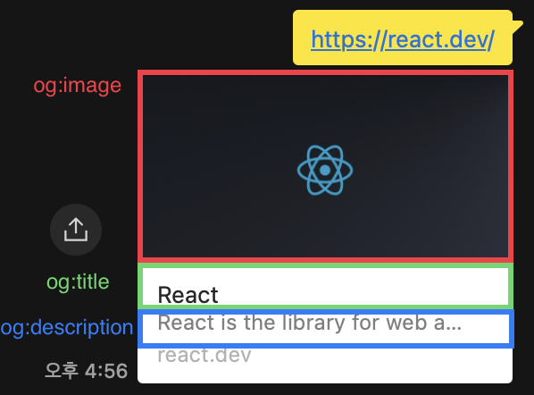

## 들어가며
프론트엔드 개발을 하다 보면 단순한 화면 작업뿐만 아니라, **SEO(Search Engine Optimization)** 와 **Open Graph**를 위한 **메타 태그(meta tag)** 를 처리해야 하는 경우가 많습니다.
저는 최근에 `커뮤니티` 도메인의 사이드 프로젝트를 진행하면서 **CSR(Client-Side Rendering)** 환경에서 동적으로 메타 태그를 생성해 제공하는 방식을 적용한 경험이 있었습니다.
 이를 바탕으로 **SEO**, **Open Graph**, **CSR** 등의 핵심 개념을 간략히 짚고, CSR 환경에서 메타 태그를 다루는 방법을 공유해보려 합니다.

### SEO란?
**SEO(Search Engine Optimization, 검색 엔진 최적화)** 는 웹사이트가 검색 엔진 결과에서 더 잘 노출될 수 있도록 최적화하는 과정입니다. 검색 상위 노출을 통해 트래픽을 유입하는 것은 웹서비스를 운영하는 기업이나 팀에게 매우 중요한 목표입니다.

SEO를 개선하는 방법에는 여러 가지가 있습니다. 대표적인 요소로는:
- **모바일 최적화**: 반응형 디자인을 적용해 모바일 사용자 경험을 개선
- **사이트맵 제공**: 검색 엔진이 사이트 구조를 쉽게 이해하도록 XML 사이트맵을 제공
- **로딩 속도 개선**: 페이지 로딩 속도를 최적화하여 사용자 이탈률을 줄임
- **HTML 및 메타 태그 최적화**: 검색 엔진이 페이지 내용을 정확히 파악할 수 있도록 HTML과 메타 태그를 적절히 설정
특히 **메타 태그(meta tag)**는 페이지의 콘텐츠를 검색 엔진과 소셜 미디어 플랫폼에 정확하게 전달하는 중요한 요소입니다.

#### 메타 태그 예시
아래는 "서울 맛집 리뷰"를 주제로 한 페이지의 메타 태그 예시입니다.
```html
<title>서울 맛집 추천 | 2024년 꼭 가봐야 할 핫플 BEST 10</title>
<meta name="description" content="서울에서 가장 인기 있는 핫플 맛집 10곳을 추천합니다. 현지인이 강력 추천하는 숨은 맛집 리스트를 확인하세요!">
<meta name="keywords" content="서울 맛집, 핫플 추천, 베스트 레스토랑, 현지인 추천">
<meta name="author" content="맛집 탐방러">
```

이러한 메타 태그를 설정하면 검색 엔진이 페이지 내용을 더 잘 이해할 수 있으며, 검색 결과에서 보다 적절한 미리보기를 제공할 수 있습니다.

다만, **Google 검색 엔진**은 `keywords`, `author` 등의 **메타 태그를 무시**한다고 공식적으로 발표한 바 있습니다. (출처: [Google 공식 블로그](https://developers.google.com/search/blog/2009/09/google-does-not-use-keywords-meta-tag?hl=ko))
하지만 검색 엔진마다 적용 방식이 다르므로, **네이버**, **빙(Bing)** 등 다양한 검색 엔진을 고려하여 메타 태그를 설정하는 것이 유리하다는 의견도 있습니다.

### 오픈 그래프 (Open Graph)?
**오픈 그래프(Open Graph, OG)**는 메타 태그를 활용하여 웹페이지가 소셜 미디어에서 공유될 때 미리보기 정보를 제어하는 기술입니다.
이 기술은 원래 페이스북(Facebook)에서 개발한 프로토콜이지만, 현재는 트위터(Twitter), 카카오톡(KakaoTalk), 디스코드(Discord) 등 다양한 플랫폼에서 활용되고 있습니다.

예시로 카카오톡으로 React 문서 페이지를 공유하면 아래 이미지처럼 나옵니다.


페이지를 열어서 개발자 도구의 element 탭에서 오픈 그래프 태그를 살펴봤습니다.
```html
<meta property="og:type" content="website" data-next-head="">
<meta property="og:url" content="https://react.dev/" data-next-head="">
<meta property="og:title" content="React" data-next-head="">
<meta property="og:description" content="React is the library for web and native user interfaces. Build user interfaces out of individual pieces called components written in JavaScript. React is designed to let you seamlessly combine components written by independent people, teams, and organizations." data-next-head="">
<meta property="og:image" content="https://react.dev/images/og-home.png" data-next-head="">
```

위의 태그의 각 `property`는 각 플랫폼에 보여지는 형태에 맞춰서 오픈그래프로 출력됩니다.
아래 이미지는 카카오톡 오픈그래프의 속성을 보기 쉽게 구조화되어있습니다.



---
0129 1707


오픈 그래프의 주요 태그
아래는 서울 맛집 리뷰 페이지를 예로 든 오픈 그래프 메타 태그 설정입니다.


### CSR, SSR ?


## 문제 발생
`커뮤니티` 도메인의 사이드 프로젝트를 진행하면서 

커뮤니티의 특징 중 하나는 유저간 링크 공유입니다. 
재밌는 글이나 있으면 자연스럽게 카톡이나 메세지로 링크를 공유하게 되는데요. 그 때 그 메세지를 전달받은 사람은 오픈그래프를 통해 사전에 정보를 습득합니다. 그 오픈그래프 정보가 흥미가 없다면 클릭해보지도 않겠죠 ? 이만큼 커뮤니티 서비스에서 오픈 그래프는 유저 유입 및 리텐션, 유저 유지에도 큰 영향을 차지합니다.

(CSR, SSR 비교 내용 필요)

그런데 저희 서비스에서는 vite + react로 csr 개발이 되어있고, S3로 정적 배포 후 cloudfront로 CDN 기능만 링킹해주는 형태로 배포되어있습니다. 그리고 네트워크 통신은 Rest api로 합니다. 그렇다면 커뮤니티의 상세 글은 FE에서 게시글 ID를 BE로 요청 후 받아올 수 있겠죠. 게시글의 제목, 내용, 이미지 의 모든 데이터를요.

URL로 특정 링크를 공유하면, 검색 엔진 크롤러 또는 오픈그래프 크롤러는 가 URL로 HTTP 요청 후 HTML을 가져옵니다. HTML의 head 태그를 가져와서 메타태그를 살펴봅니다. 그리고 정해진 태그에 할당된 이미지나 텍스트를 오픈그래프 프리뷰형태로 보여주죠. 글 링크를 공유하면, HTML을 가져왔을 때 head 태그에 게시글 제목, 이미지, 내용이 있어야 오픈그래프에 보이겠죠 ? 근데 CSR은 SSR과 다르게 첫 HTML은 빈 껍데기입니다. 클라이언트에서 자바스크립트를 실행하면서 서버에 데이터 요청도 하고 화면을 렌더링 하기 때문입니다. 그렇다면 정리할 수 있습니다. CSR은 오픈 그래프에서 서버 데이터를 가져올 수 없습니다. 그럼 유저 유입에 불리하겠죠 ? 어떤 수를 써서라도 오픈그래프를 만들어야합니다. 이 방식을 해결하는 방법은 저는 크게 2개로 봤습니다. 1. SSR 방식으로 만든다. 2. HTML 요청이오면 서버응답을 받아  HTML 을 새로 만들어서 변환한다. 저는 2번을 택했어요. 이미 만들어진 코드가 많았기 때문에 SSR로 마이그레이션하는 공수가 크다고 판단했기 때문입니다. 2번을 구현해주는 기술이 AWS의 람다엣지 함수였습니다. 


---

## 문제 발생

## 참고 자료
[SEO - MDN Web Docs](https://developer.mozilla.org/ko/docs/Glossary/SEO)
[SEO 가이드 - Google](https://developers.google.com/search/docs/fundamentals/seo-starter-guide?hl=ko)