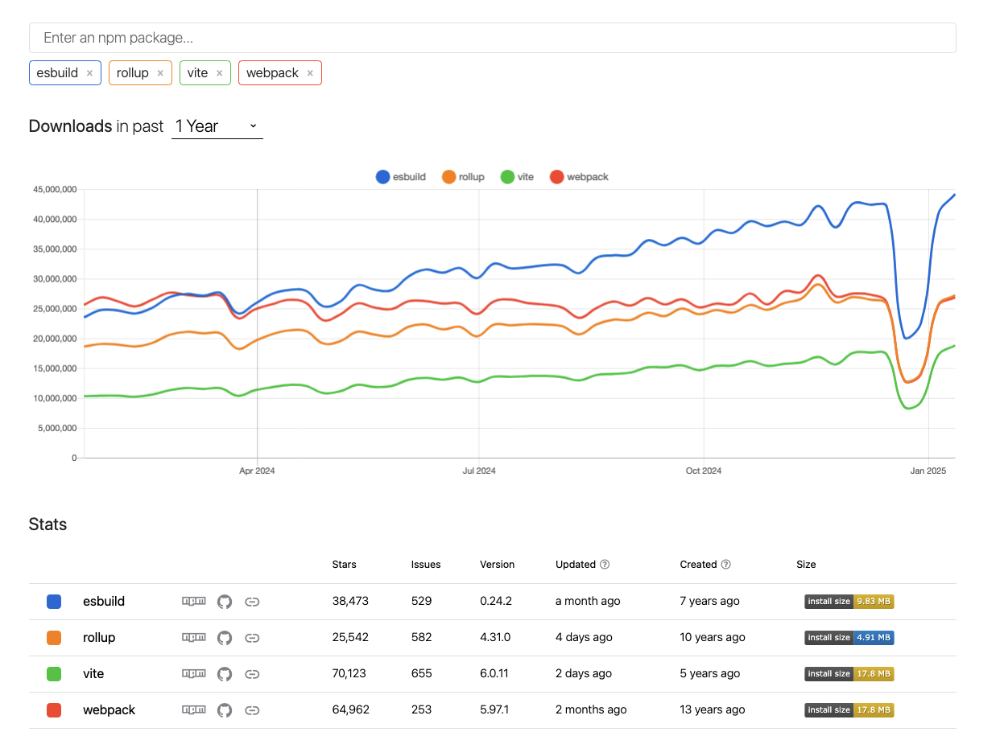
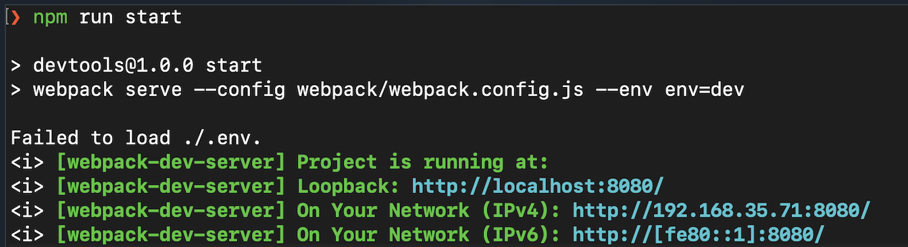
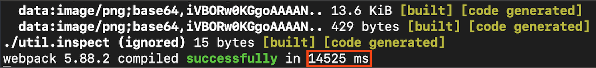
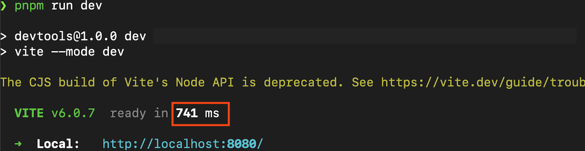
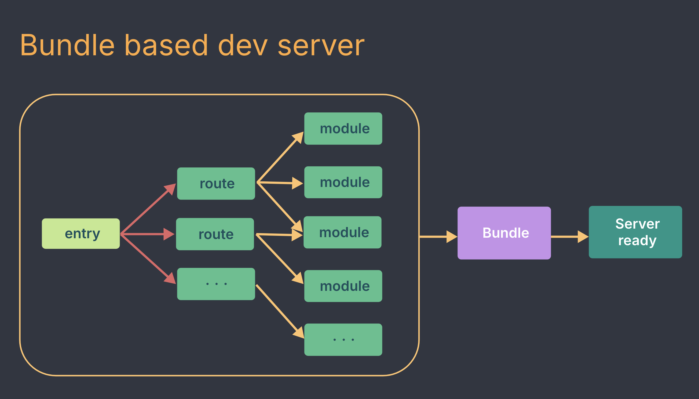
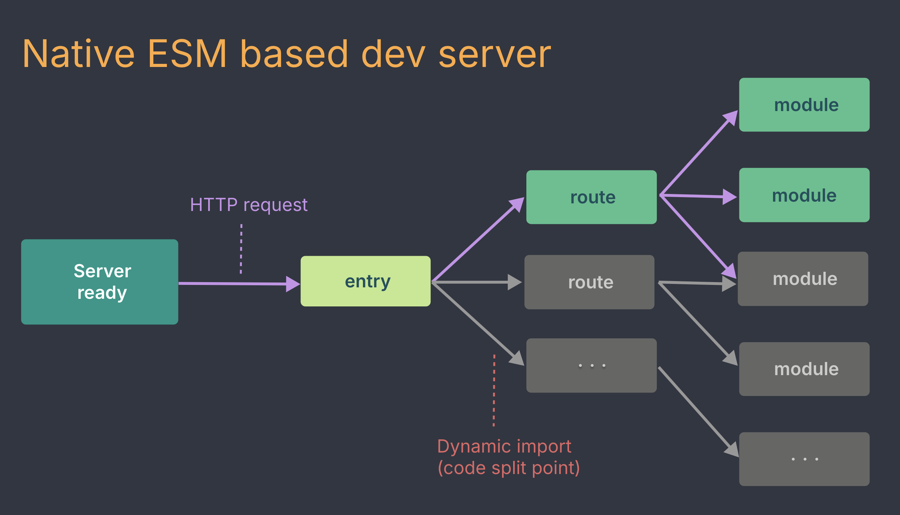
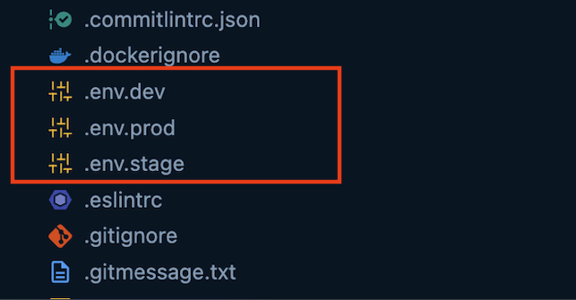
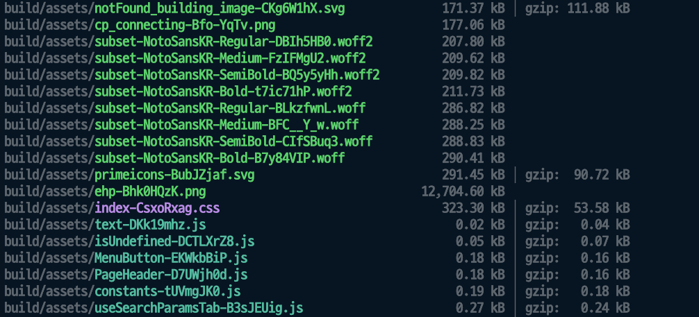
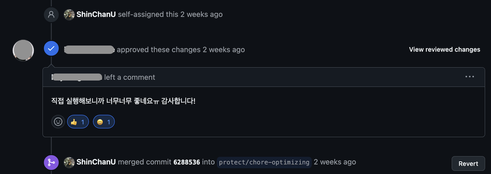

## 🛠️ 번들러란 ?

웹, 앱을 개발하다 보면 많은 자바스크립트 파일을 만들고, 분리하고, 가져오기를 반복합니다.
그렇게 할 수 있는 이유는 **번들러 (`bundler`)** 라는 불리는 도구 덕분입니다. **번들러란,** **여러 파일의 종속성을 하나의 파일로 정리하고 결합하는 도구**입니다.

쉽게 말해, 여러 개의 자바스크립트 파일을 하나의 자바스크립트 파일로 합쳐주는 도구입니다 !

<br />

#### 번들러 비교 및 정리
번들러의 종류는 많지만, 몇 개만 간단하게 소개 및 비교를 했습니다.

1. **Webpack** [2012 ~ ] <br />
   2012년도에 등장한 번들링 도구입니다. **강력한 생태계를 보유**하고 있고, 확장성이 좋아서 대규모 프로젝트에 적합하고 `js`, `css`, `이미지` 등도 처리할 수 있습니다. 그 외에도 `Tree-shaking`, `Code Splitting`, `Loader` 등 다양한 플러그인을 지원합니다.
   
   **장점** : 많은 자료와, 큰 커뮤니티로 자료 및 예시가 풍부
   
   **단점** : 설정이 복잡하여 러닝 커브가 높은 편, 프로젝트 사이즈가 클수록 빌드 시간이 길어질 수 있음(물론 캐시와 병렬 처리로 개선 가능)

   <br/>

2. **Rollup** [2015 ~ ] <br />
    함수로 래핑하여 평가하는 `Webpack`과 달리, `Rollup`은 모든 코드를 호이스팅하여 한꺼번에 번들링을 진행합니다. 그렇기 때문에 번들링이 빠르며 또한 내부적으로 ES6 타입스크립트를 사용하고 있기에 **라이브러리 구축과 확장**에 특화된 모듈 번들러입니다.

   **장점** : `Webpack`보다 빠른 속도. 확장에 용이하여 라이브러리 개발에 적합한 도구

   **단점** : 설정이 복잡한 편

   <br/>

3. **EsBuild**  [2018 ~ ] <br />
   `Go` 언어로 작성되어 **번들링 및 트랜스파일링 속도가 매우 빠른 편**입니다. (`Webpack` 대비 10 ~ 100배 빠름)

   **장점** : 매우 빠른 빌드 및 번들링 속도, 트랜스파일러로서도 활용 가능

   **단점** : 개발 생태계가 아직 성장 단계
   
   <br/>

4. **Vite**  [2020 ~ ] <br />
   4개 중 가장 최신 번들러이며, `Esbuild` 와 `Rollup` 의 장점들을 모았습니다. 개발 모드에서는 `Esbuild` 를 사용하여 **빠른 사전 번들링과 HMR** 를 적용하고, 프로덕션 모드에서는 **유연하고 확장**이 쉬운 `Rollup` 을 사용하여 번들링을 최적화합니다. 특히 HMR 시, 브라우저에 `Native ESM` 코드 제공으로 빠른 갱신 속도를 보여줍니다.

   **장점** : 설정이 쉬우며, 빌드와 HMR이 매우 빠름

   **단점** : 개발 생태계가 아직 성장 단계, 브라우저용 번들링으로는 안정성이 떨어진다는 평가.



표로 정리하면 아래와 같습니다.

|번들러|출시연도|장점|단점|
|---|---|---|---|
|**Webpack**|2012|강력한 생태계|설정 복잡, 빌드 속도 느림
|**Rollup**|2015|빠른 번들링 속도|설정 복잡
|**EsBuild**|2018|매우 빠른 빌드 속도|생태계 미성숙
|**Vite**|2020|빠른 HMR, 쉬운 설정|생태계 미성숙

---

## 🔑 `Vite` 를 선택한 진짜 이유
`Vite` 를 선택한 이유는 단순합니다. 바로 **개발자 경험(DX)** 때문이였습니다.

저는 이제 3년차에 접어든 프론트엔드 개발자입니다. 현재 회사에서는 제가 구축한 프로젝트를 2년 넘게 개발 및 유지 보수를 하고 있습니다. 
2년 전 쌩신입이였던 저는 신규 프로젝트를 구축해야했고, 기존에 안정적으로 동작하던 사내 타 프로젝트 세팅을 그대로 가져왔었습니다. 그 세팅이 `Webpack` 번들러 기반 `React` 프로젝트였습니다. 

저는 2년 동안은 실무에 적응하며 주어진 기능 개발에 온전히 시간을 쏟을 수 밖에 없었고, 이제 시간이 어느 정도 흐르고 나니 저 스스로 주도적으로 기술을 찾고 불편함을 개선하려는 시도를 하게 되는 것 같습니다. 그 중 하나가 번들러 교체였습니다. 교체를 해야겠다고 생각한 **가장 주된 이유**는 `Webpack` 으로 **개발 서버를 띄우는 시간이 너무 오래걸렸기 때문**입니다. 개발을 하려면 항상 로컬 개발 서버를 띄워야했고 심지어 config 파일 수정이나, node 모듈이 엉키는 경우 서버를 내렸다 다시 올리는 작업도 많이 해야합니다. 제 프로젝트 기준 서버를 올리는데 평균 `15초` 의 시간이 소요가 되니 그 시간동안 작업이 멈추곤 했습니다. DX가 안 좋을 수 밖에 없었습니다.  


테스트를 해보니, `14.5초`가 걸렸습니다.

 물론 `Webpack` 은 아주 훌륭한 번들러지만, **개발 서버를 띄울 때, 모든 모듈과 종속성을 한번에 번들링** 하는 과정이 긴 콜드 스타트를 만들어 개발자 경험을 떨어뜨리는다는 점이 아쉬웠습니다.
 
 그렇게 저는 여러 번들러 찾아보았고, 결국 **`Vite`로 마이그레이션** 을 결정하게 되었습니다. 
 
결과를 먼저 보여드리면 `0.7초` 네요. `Webpack` 과 비교하면 **`95%`** 감소한 수치입니다. 놀랍습니다.

`Vite`가 이렇게 빠른 이유는,  **개발 서버를 띄울 때 번들링을 건너 뛰고, 필요한 모듈의 `네이티브 ESM` 소스 코드를 직접 제공하는 방식**으로 콜드 스타트를 매우 짧게 가져가기 때문입니다. 또한 `Vite`의 `HMR` 도 같은 동작 과정으로 변경된 모듈만 즉각 갱신됩니다. `Webpack` 처럼 전체 종속성을 다시 번들링하지 않아도 되어 브라우저가 즉각적으로 업데이트를 반영합니다. 특히 CSS 파일의 변경도 빠르게 적용되므로 스타일 수정 작업이 한결 편리합니다. `Webpack`과 `Vite`의 개발 서버 구동의 차이점은 `Vite` 문서에서 가져온 아래 이미지들을 참고하면 더 이해가 쉽습니다.




개발 서버가 빠르게 구동되기 때문에, DX 가 훌륭할 수 밖에 없습니다. `run dev` 스크립트를 치고 바로 개발에 돌입할 수 있으니까요 ! 


이와 관련한 더 자세한 내용은 한글로 된 공식 문서도 있으니 한번 읽어보시길 추천합니다. ([Vite 문서](https://ko.vite.dev/guide/why))

---

## 💡 마이그레이션 과정
마이그레이션 과정은 그렇게 어렵지 않았습니다. 
그렇지만 각자의 프로젝트 환경은 다르기에 자세한 내용은 `Vite` 문서도 잘 되어있고, 도움이 되는 블로그 글도 많이 있으니 참고하면 좋을 듯 합니다. 이곳에는 제 프로젝트에 적용했던 내용을 위주로 정리해두려합니다. `Vite` 버전은 6 기준 입니다.

### 1단계: `Vite` 설치 및 플러그인 추가
루트 경로에서 `Vite` 를 설치합니다.
```bash
pnpm add -D vite
```

추가적으로, 프론트엔드 스택에 맞춰서 플러그인을 설치해야할 수 있습니다. React 프로젝트라면 아래 명령어를 사용합니다.
```bash
pnpm add -D @vitejs/plugin-react
```

이 부분은 `@vitejs/plugin-react`를 설치해도되고, `@vitejs/plugin-react-swc`를 설치해도됩니다. 
간단하게 차이점을 설명드리면, `@vitejs/plugin-react`는 풍부한 플러그인을 갖고있는 `Babel` 기반으로 트랜스파일링을 도와주고, `@vitejs/plugin-react-swc`는 매우 빠른 속도를 지원하는 `Rust` 로 작성된 `SWC` 로 트랜스파일을 도와주는 도구입니다.
저는 기존 프로젝트에 `Babel` 설정이 좀 많아서 `@vitejs/plugin-react`를 사용했습니다.

### 2단계: `Vite` 설정 파일 구성
`vite.config.(js|ts)` 파일을 만들고, 필요하다면 기존 `Webpack` 설정을 옮겨주면 됩니다.
```ts
import { defineConfig } from 'vite';
import react from '@vitejs/plugin-react';

export default defineConfig({
  plugins: [react()],
  resolve: {
    alias: {
      "@": path.resolve(__dirname, "src"),
    },
  },
  server: {
    open: true,
    port: 3000,
  },
  build: {
    outDir: 'build',
  },
});
```
예시 코드는 위와 같고, `resolve.alias` 설정을 해주고, 로컬 서버 `port`와 자동 열림(`open`) 상태를 지정해주면 됩니다. 또한 저는 `build` 옵션으로 `outDir` 을 `build`로 바꿔뒀습니다. 기본값은 `dist` 입니다. 그외 내용은 `webpack.config` 파일을 참고하여 반영하면 됩니다. 


### 3단계: `index.html` 및 환경 변수 변경
- `Vite`는 기본적으로 `index.html` 파일을 루트 경로에 두어야합니다. 또한 SPA의 진입점에 해당하는 컴포넌트 `src`를 연결합니다. `script`의 `src` 경로를 수정해야할 수도 있습니다.
   ```ts
   <html>
   <head></head>
   <body>
      <div id="root"></div>
      <!-- 여기! -->
      <script type="module" src="/src/index.tsx"></script>
   </body>
   </html>
   ```

<br />

- 환경 변수도 처리도 해줍니다. 기존에 사용하던 `webpack.config.js`에 있던 환경 변수 코드입니다.
   ```js
   new webpack.DefinePlugin({
      "process.env.API_URL": JSON.stringify("https://api.example.com"),
   }),
   ```

   `Vite`에서는 `.env` 파일에 선언해두면됩니다.
   ```arduino
   VITE_API_URL=https://api.example.com
   ```
   사용할 때는 아래처럼 사용하면 됩니다.
   ```ts
   const apiUrl = import.meta.env.VITE_API_URL;
   ```
   타입추론을 원한다면 `vite-env.d.ts` 를 만들어서 환경 변수 내용을 담아둘 수도 있습니다.
   ```ts
   /// <reference types="vite/client" />

   interface ImportMetaEnv {
      readonly VITE_API_URL: string;
   }

   interface ImportMeta {
      readonly env: ImportMetaEnv;
   }
   ```
   [환경 변수의 모드](https://vite.dev/guide/env-and-mode)도 지원해줍니다. 
   ```ts
   .env                # loaded in all cases
   .env.local          # loaded in all cases, ignored by git
   .env.[mode]         # only loaded in specified mode
   .env.[mode].local   # only loaded in specified mode, ignored by git
   ```
   제 경우에도 `dev`, `stage`, `prod` 브랜치별로 배포를 하기에 모드 옵션을 적극활용했습니다. 
   
   

### 4단계: `package.json` 업데이트 및 테스트
로컬 서버 실행, 빌드, preview 등 자주 쓰는 명령어들을 등록해둡니다.
```json
// package.json
"scripts": {
   "dev": "vite --mode dev",
   "build:dev": "vite build --mode dev",
   "build:stage": "vite build --mode stage",
   "build:prod": "vite build --mode prod",
   "preview": "vite preview",
},
```

이젠 `run dev`를 실행하고, `run build` 등을 테스트해보며 정상 작동하는 지를 확인하면 됩니다 !

`0.7` 초만에 로컬 서버가 열리는 놀라운 일이 일어났습니다! (`Webpack` 은 `14`초 였는데...)


`build` 스크립트도 잘 작동하네요 ! `build` 에 대한 성능 비교도 결과 챕터에서 다루겠습니다.


### 5단계: `Webpack` 코드 정리

이제 `Webpack` 의존성 및 코드를 모두 삭제합니다.

---

## 📈 마이그레이션 결과

마이그레이션을 다했으니, 마이그레이션 전, 후에 대해 지표를 선정해서 비교해보려고 합니다.

비교 항목은, **개발 서버를 띄우는 시간(`open time`)**, **빌드 시간 (`build time`)**, **빌드 후 번들 크기 (`bundle size`)** 로 **총 3개**로 정했습니다.
시간 측정 항목은 오차를 줄이기 위해 **5번** 진행했고, 빌드 시간은 로컬에서 진행했습니다. (`git action`도 테스트해봤는데 비슷했습니다.) 

|번들러|open time|build time|bundle size|
|--|--|--|--|
| **Webpack**  | 15.81s<br />14.73s<br />14.69s<br />15.93s<br />14.09s<br /> 평균 : **15.05s** | 14.0s<br />14.2s<br />14.5s<br />14.2s<br />14.0s<br /> 평균 : **14.2s** | **50.1MB**       |
| **Vite**     | 0.109s<br />0.127s<br />0.100s<br />0.102s<br />0.099s<br /> 평균 : **0.107s** | 7.4s<br />7.4s<br />7.3s<br />7.3s<br />7.2s<br /> 평균 : **7.3s** | **23.3MB**       |
| **성능 증감율**    |**99.29% 감소 (14.94s)**| **48.59% 감소 (6.9s)**             | **53.49% 감소 (26.8MB)** |

어떤가요 ? 이 정도 수치면, 유의미한 마이그레이션 과정이라고 판단됩니다 !

**개발자 경험 향상**은 **업무 효율 증진**으로 이어지고, 이는 곧 **고품질 프로덕트와 UX 개선**으로까지 이어진다고 생각합니다.

<br />
마이그레이션 작업을 PR로 올렸고 같은 팀원분도 너무 좋다고 말씀해주시니 더 뿌듯했습니다!



<br />

이후에도 `코드 스플리팅` 과 `chunk 분리 작업`을 추가로 진행했는데, 그 내용도 시간이 되는 대로 정리를 할까 싶습니다.

<br />

저에게 `Vite`로의 마이그레이션은 단순히 도구를 바꾼 것보다는 더 나은 개발 환경을 추구하는 과정과 결과라는 점에서 유의미한 실험이였습니다.

여러분도 지금의 방식이 불편하다면, 그것이 무엇이든 과감히 새로운 방향으로 시도해 보세요. 불편함의 개선은 언제나 옳다는 점을 이번에도 느꼈습니다 !

<br />

모두 즐거운 개발하세요 ! 읽어주셔서 감사합니다 😊

---

## 📑 참고자료

[웹 개발에서의 다양한 빌드 도구 비교: Webpack, Rollup, Vite](https://f-lab.kr/insight/web-development-build-tools-comparison)